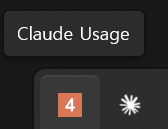
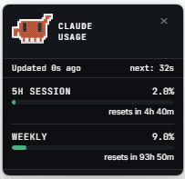
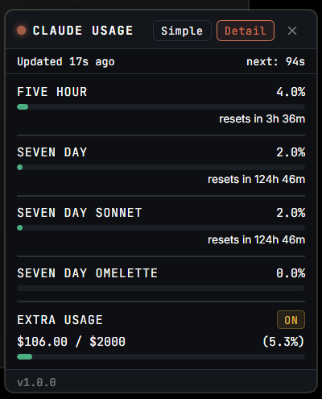

# Claude Usage Widget

Claude.ai 구독 플랜의 사용량(5시간 세션, 주간 한도, 추가 사용량)을 실시간으로 모니터링하는 Windows 트레이 위젯.

---

## 미리보기

| 트레이 아이콘 | Simple 모드 | Detail 모드 |
|:---:|:---:|:---:|
|  |  |  |

---

## 목차

1. [동작 방식](#동작-방식)
2. [소스 구조](#소스-구조)
3. [인증 방식](#인증-방식)
4. [요구사항](#요구사항)
5. [설치 및 실행](#설치-및-실행)
6. [EXE로 빌드](#exe로-빌드)
7. [사용 방법](#사용-방법)
8. [설정](#설정)
9. [로그](#로그)
10. [주의사항](#주의사항)

---

## 동작 방식

```
~/.claude/.credentials.json
          │
          │  OAuth 토큰 읽기 / 만료 시 직접 갱신
          ▼
      auth.py
          │
          │  Bearer 토큰으로 인증
          ▼
  api.anthropic.com/api/oauth/usage
          │
          │  poll_interval 초마다 폴링
          ▼
      overlay.py  ──────────────────────────────────────┐
          │                                             │
          │  JS로 데이터 전달                            │  트레이 아이콘
          ▼                                             │  5H 사용률 숫자 표시
     popup.html  ─── 위젯 UI 렌더링                     │
                                                        ▼
                                                    main.py
```

1. 시작 시 `~/.claude/.credentials.json`에서 OAuth 액세스 토큰을 읽습니다.
2. `api.anthropic.com/api/oauth/usage`를 주기적으로 폴링해 사용량 데이터를 가져옵니다.
3. 위젯 UI(pywebview + HTML/CSS)와 트레이 아이콘에 실시간으로 반영합니다.
4. 토큰이 만료되면 OAuth 엔드포인트에 직접 refresh 요청을 보내 자동 갱신합니다.

---

## 소스 구조

```
claude-usage-widget/
├── main.py          진입점 — 트레이 아이콘, 폴링 루프, 단일 인스턴스 락
├── auth.py          OAuth 토큰 로드 / 만료 감지 / 자동 갱신
├── api.py           사용량 API 호출
├── overlay.py       pywebview 창 관리 (show/hide/update/mark_stale)
├── config.py        config.json 읽기/저장, 시작 프로그램 레지스트리 설정
├── logger.py        RotatingFileHandler 기반 전역 로거 설정
├── popup.html       위젯 UI — 프로그레스 바, 카운트다운, 모드 전환
├── build.py         PyInstaller EXE 빌드 스크립트 (onedir)
├── widget.log       실행 로그 (자동 생성, 512KB × 3 롤링)
├── config.json      사용자 설정 (자동 생성)
├── FIX.md           수정/오류 조치 기록
├── _hooks/
│   ├── log_fix.py       PostToolUse — 소스 수정 시 FIX.md 자동 기록
│   └── require_note.py  PreToolUse  — FIX.md 미기입 항목 있으면 편집 차단
├── .claude/
│   ├── settings.json       훅 설정
│   └── settings.local.json 로컬 권한 설정
└── old/
    ├── CHANGELOG.md    (통합 전 원본)
    └── FIXES.md        (통합 전 원본)
```

### 모듈 간 의존 관계

```
main.py
  ├── auth.py   ← logger.py
  ├── api.py    ← logger.py, auth.py
  ├── overlay.py ← logger.py
  ├── config.py
  └── logger.py
```

---

## 인증 방식

이 위젯은 **Claude Code가 보관하는 OAuth 토큰을 재활용**합니다. 별도 로그인 과정이 없습니다.

### 토큰 위치 (우선순위 순)

```
~/.claude/.credentials.json
~/.claude/credentials.json
%APPDATA%/Claude/credentials.json
$CLAUDE_CONFIG_DIR/credentials.json  (환경변수 설정 시)
```

### 토큰 갱신

토큰 만료 60초 전부터 자동 갱신을 시도합니다.  
`claude auth` CLI에는 토큰 갱신 서브커맨드가 없어 OAuth 엔드포인트를 직접 호출합니다.

```
POST https://console.anthropic.com/v1/oauth/token
{ grant_type: "refresh_token", refresh_token: "...", client_id: "9d1c250a-..." }
```

갱신 성공 시 새 토큰을 기존 파일 구조를 보존하며 atomic write(`.tmp` → `replace`)로 저장합니다.

### 첫 실행 안내

Claude Code CLI가 설치되지 않았거나 로그인되지 않은 상태에서 위젯을 실행하면, 위젯이 자동으로 표시되어 **"Claude Code CLI 재실행 필요"** 안내를 보여줍니다.

### 재로그인 필요 상태

refresh가 실패하면 위젯에 빨간 글씨로 안내가 표시됩니다.

| 상태 | 원인 | 해결 |
|------|------|------|
| `reauth_needed` | refresh token이 서버에서 거부됨 (HTTP 400/401) | `claude` 실행 후 `/login` |
| `no_credentials` | credentials.json 파일 없음 | Claude Code 설치 및 로그인 |
| `no_refresh_token` | 파일은 있으나 refreshToken 필드 없음 | `claude` 실행 후 `/login` |
| `transient` | 네트워크/5xx 등 일시적 오류 | 자동 재시도 |

> **참고**: `client_id`(`9d1c250a-e61b-44d9-88ed-5944d1962f5e`)는 Claude Code의 공개 OAuth 값입니다. Anthropic이 변경하면 `auth.py`의 `CLIENT_ID`를 업데이트해야 합니다.

---

## 요구사항

| 항목 | 버전 |
|------|------|
| OS | Windows 10 / 11 |
| Python | 3.11 ~ 3.13 |
| Claude Code | 설치 필수 (토큰 소스) |
| Edge WebView2 Runtime | Windows 11 기본 내장, Windows 10은 별도 설치 필요 |

### Edge WebView2 Runtime (Windows 10 전용)

Edge가 설치된 PC라면 WebView2도 함께 설치되어 있습니다.  
없는 경우: https://developer.microsoft.com/en-us/microsoft-edge/webview2/

---

## 설치 및 실행

> **필수 전제조건**: [Claude Code CLI](https://claude.ai/download)가 설치되어 있고 로그인된 상태여야 합니다. 이 위젯은 Claude Code가 저장한 OAuth 토큰(`~/.claude/.credentials.json`)을 재활용합니다.

### 방법 A — 빌드된 EXE 직접 실행 (권장)

Python 설치 없이 바로 실행할 수 있습니다.

[GitHub Releases](https://github.com/Sayh0/ullmananamazzi/releases)에서 최신 zip을 다운로드한 뒤 압축을 풀고 `ullmananamazzi.exe`를 실행합니다. `config.json`과 `widget.log`는 EXE와 같은 폴더에 자동 생성됩니다.

### 방법 B — 소스에서 직접 실행

#### 1. 의존성 설치

```bash
pip install -r requirements.txt
```

#### 2. 실행

```bash
python main.py
```

실행 후 시스템 트레이(우측 하단)에 아이콘이 나타납니다.
이미 실행 중인 인스턴스가 있으면 중복 실행 없이 즉시 종료됩니다 (Windows 네임드 뮤텍스).

> **첫 실행 시**: Claude Code CLI 로그인이 안 된 상태이면 위젯이 자동으로 열려 안내 메시지를 표시합니다. 터미널에서 `claude` 실행 후 `/login`으로 로그인하세요.

---

## EXE로 빌드

```bash
pip install pyinstaller
python build.py
```

빌드 완료 후 `dist/ullmananamazzi/` 폴더가 생성됩니다. 안의 `ullmananamazzi.exe`를 실행합니다.

> `config.json`과 `widget.log`는 EXE와 같은 폴더에 자동 생성됩니다.

---

## 사용 방법

### 트레이 아이콘

| 상태 | 아이콘 | 설명 |
|------|--------|------|
| 데이터 수신 전 | 회색 `--` | 첫 폴링 대기 중 |
| 정상 | 주황 배경 + 숫자 | 5H 세션 사용률 (예: `25`) |
| 소진 (100%) | 빨간 배경 + `!!` | 세션 한도 도달 |

- **좌클릭**: 위젯 창 표시/숨김 토글
- **우클릭**: 메뉴

| 메뉴 항목 | 설명 |
|-----------|------|
| Show / Hide | 위젯 창 표시/숨김 |
| Always on Top | 화면에 항상 떠있는 오버레이 모드 |
| Start with Windows | Windows 시작 시 자동 실행 |
| Display Mode > Simple | 간략 모드 |
| Display Mode > Detailed | 상세 모드 |
| Quit | 앱 종료 |

### 위젯 창

헤더를 드래그해 위치를 이동할 수 있으며, 위치는 자동 저장됩니다.

#### Simple 모드 (기본)

| 항목 | 내용 |
|------|------|
| 5H SESSION | 5시간 세션 사용량 + 리셋까지 남은 시간 |
| WEEKLY | 주간 사용량 + 리셋까지 남은 시간 |

#### Detailed 모드

API 응답의 모든 quota 필드를 표시합니다. Anthropic이 새 필드를 추가하면 자동으로 나타납니다.

#### 상태 표시

| 표시 | 의미 |
|------|------|
| 점(●) 펄스 애니메이션 | 정상 동작 중 |
| `Updated Xs ago` | 마지막 갱신 시각 |
| `next: Xs` | 다음 갱신까지 카운트다운 |
| 흐려짐 + `⚠ stale` | 데이터 갱신 실패 |
| 빨간 글씨 재로그인 안내 | OAuth 토큰 무효 |

#### 프로그레스 바 색상

| 색상 | 구간 |
|------|------|
| 초록 | 70% 미만 |
| 노랑 | 70 ~ 90% |
| 빨강 | 90% 이상 |

---

## 설정

`config.json` 파일을 직접 편집해 설정을 변경할 수 있습니다. 앱 재시작 후 반영됩니다.

```json
{
  "always_on_top_overlay": false,
  "start_with_windows": false,
  "display_mode": "simple",
  "poll_interval": 120,
  "overlay_x": 20,
  "overlay_y": 20
}
```

| 키 | 기본값 | 설명 |
|----|--------|------|
| `always_on_top_overlay` | `false` | `true` 시 항상 화면에 표시 |
| `start_with_windows` | `false` | `true` 시 Windows 시작 시 자동 실행 |
| `display_mode` | `"simple"` | `"simple"` 또는 `"detailed"` |
| `poll_interval` | `120` | API 폴링 간격 (초). 테스트 결과 10초 이내 연속 요청 시 429 발생 확인. 60초 이하 비권장 |
| `overlay_x` / `overlay_y` | `20` | 위젯 창 초기 위치 |

---

## 로그

`widget.log`에 실행 로그가 기록됩니다. 512KB 초과 시 자동 롤링되며 최대 3개 보관됩니다.

```
widget.log      # 현재 로그
widget.log.1    # 이전 로그
widget.log.2    # 그 이전 로그
```

**로그 포맷**

```
2026-05-18 00:45:00 | INFO    | main     | widget started pid=1234 python=3.12.3
2026-05-18 00:45:01 | INFO    | auth     | refreshing token...
2026-05-18 00:45:02 | INFO    | auth     | token refreshed — expires in 3600s
2026-05-18 00:45:02 | INFO    | api      | GET /api/oauth/usage → 200 (312ms)
2026-05-18 01:45:02 | ERROR   | auth     | refresh failed HTTP 401: Unauthorized → status=reauth_needed
```

---

## 보안

- **토큰을 외부로 전송하지 않습니다.** `api.anthropic.com`과 `console.anthropic.com`에만 사용합니다.
- **읽기 전용입니다.** 사용량 조회만 하며 계정 설정 변경이나 대화 접근은 하지 않습니다.
- **credentials.json atomic write.** 갱신 시 `.tmp` → `replace` 방식으로 파일 손상을 방지합니다.

---

## 주의사항

- **비공식 API**: `api.anthropic.com/api/oauth/usage`는 Anthropic이 공개한 공식 API가 아닙니다. 언제든 변경되거나 차단될 수 있습니다.
- **Claude Code 필수**: 토큰을 `~/.claude/credentials.json`에서 읽으므로 Claude Code가 설치되어 있고 로그인된 상태여야 합니다.
- **개인 사용 목적**: 본인 계정의 사용량만 조회합니다.

API 변경 여부를 모니터링하려면 동일한 엔드포인트를 사용하는 아래 레퍼런스 프로젝트를 함께 확인하세요.

---

## 레퍼런스

- [jens-duttke/usage-monitor-for-claude](https://github.com/jens-duttke/usage-monitor-for-claude) — 동일한 비공식 API를 사용하는 레퍼런스 프로젝트. API 엔드포인트나 응답 구조가 변경될 경우 해당 레포의 이슈/커밋을 통해 빠르게 확인 가능.
